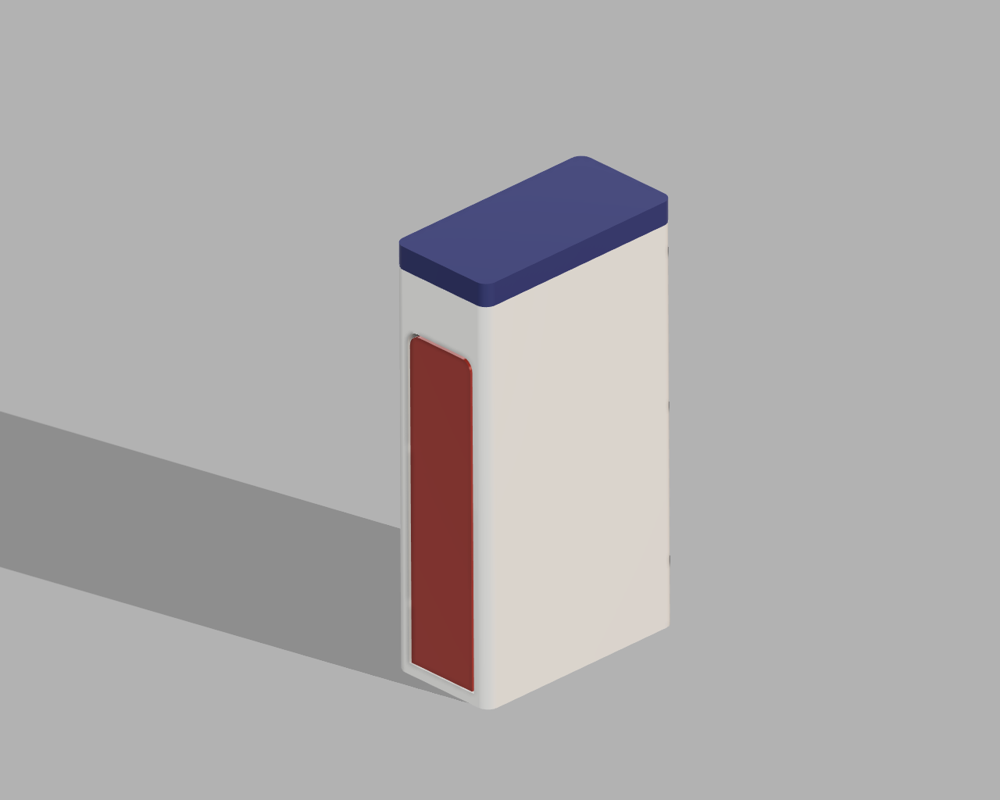
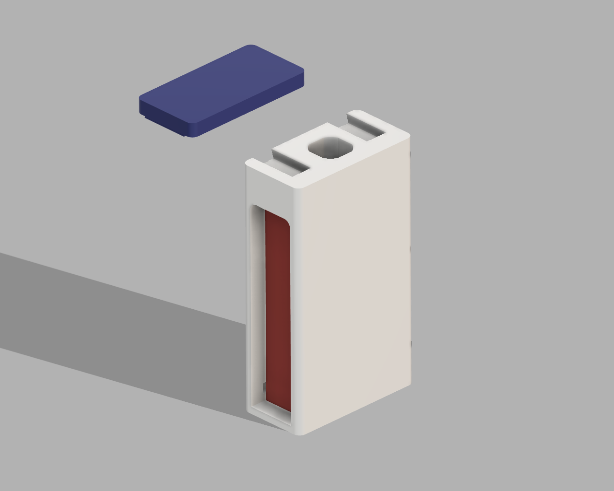
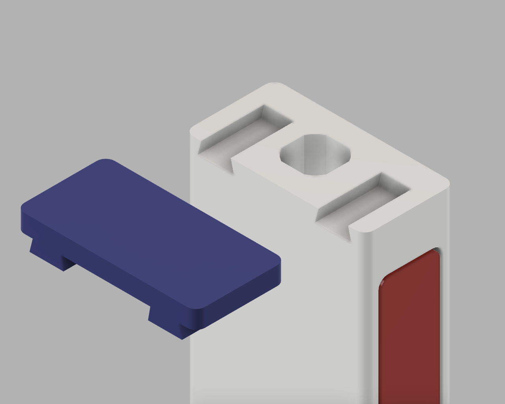
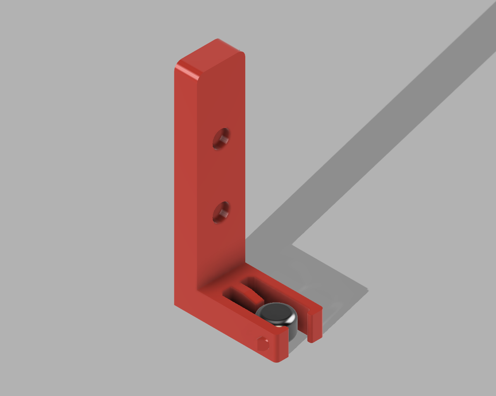
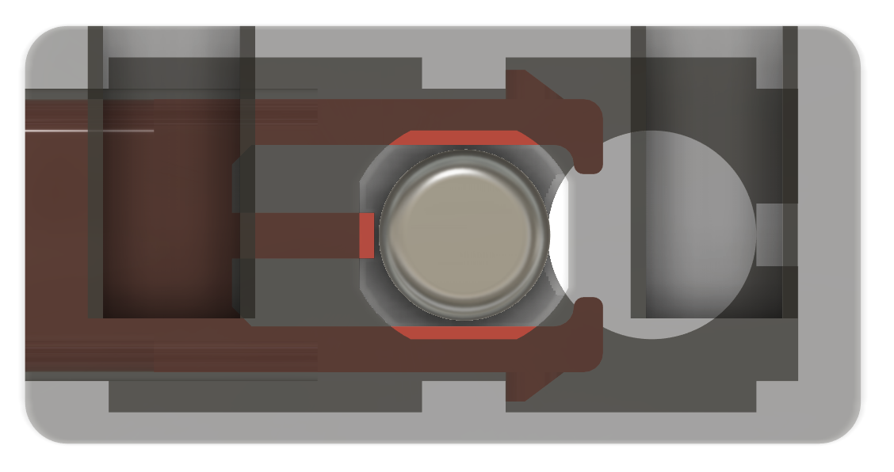

<!DOCTYPE html>
<html>
<head>

</head>

<body>

# Pills Dispenser
This projects shows a 3D model of a pills dispenser.

The following software can deduce the least expensive path from the imported plane using the Dijkstra's algorithm and python.

## Table of Contents
1.  [Project contains](#project-contains)
2.  [Project preview](#project-preview)
3.  [Assembly](#assembly)
	1. [How to acquire springs?](#how-to-acquire-springs)
	2. [How to join button with a body?](#how-to-join-button-with-a-body)

# Project contains

* .f3d file
* Three .stl files meant for 3D printing
	* body
	* button
	* slider_top

# Project preview

<table style="text-align:center">
    <tr>
      <td>
          
      </td>
      <td>
          
      </td>
    </tr>
    <tr>
      <td>
          
      </td>
      <td>
          
      </td>
    </tr>
    <tr>
      <td colspan="2">
           
          
      </td>
    </tr>
  </table>

# Assembly

Since dispenser consists of 3 parts, it is straightforward to put it together.

__Top slider__ is relatively easy to assemble, just slide the part to the slot of the body.

__The button__ is the part that is worth noting. On the rear side you can find __2 holes__, they are meant for springs that prevent the button from collapsing.

## How to acquire springs?

You can find appropriate spring in almost every pen. Springs used inside should measure approximately 2,5 cm.
__Just cut it in half, and you have two springs that are ready to be mounted with a glue on the button__

## How to join button with a body?
After mounting the springs with a glue try to gently push the button inside a slot of a body part.

</body>
</html>